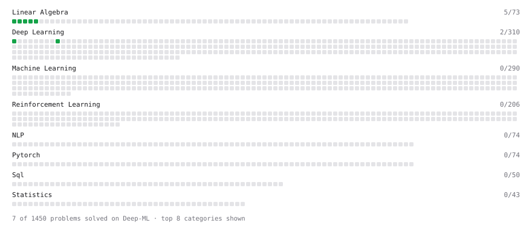

# Deep-ML

My machine learning practice from [Deep-ML](https://www.deep-ml.com). Every solution here was written by hand.

**14** solved · 13 problems · 0 labs · 1 math

[**Browse the interactive portfolio**](https://subhajitchatterjee07.github.io/deep-ml/) to replay this filling in over time.

## Problems

| | Difficulty | Solved | |
| --- | --- | --- | --- |
| [Calculate 2x2 Matrix Inverse](https://www.deep-ml.com/problems/8) | easy | 2026-09-26 | [solution](problems/0008-calculate-2x2-matrix-inverse) |
| [Calculate Covariance Matrix](https://www.deep-ml.com/problems/10) | easy | 2026-09-27 | [solution](problems/0010-calculate-covariance-matrix) |
| [Calculate Mean by Row or Column](https://www.deep-ml.com/problems/4) | easy | 2026-09-26 | [solution](problems/0004-calculate-mean-by-row-or-column) |
| [Implement ReLU Activation Function](https://www.deep-ml.com/problems/42) | easy | 2024-10-13 | [solution](problems/0042-implement-relu-activation-function) |
| [Matrix-Vector Dot Product](https://www.deep-ml.com/problems/1) | easy | 2024-10-13 | [solution](problems/0001-matrix-vector-dot-product) |
| [Reshape Matrix](https://www.deep-ml.com/problems/3) | easy | 2026-09-26 | [solution](problems/0003-reshape-matrix) |
| [Scalar Multiplication of a Matrix](https://www.deep-ml.com/problems/5) | easy | 2026-09-26 | [solution](problems/0005-scalar-multiplication-of-a-matrix) |
| [Sigmoid Activation Function Understanding](https://www.deep-ml.com/problems/22) | easy | 2024-10-20 | [solution](problems/0022-sigmoid-activation-function-understanding) |
| [Softmax Activation Function Implementation ](https://www.deep-ml.com/problems/23) | easy | 2026-09-28 | [solution](problems/0023-softmax-activation-function-implementation) |
| [Transpose of a Matrix](https://www.deep-ml.com/problems/2) | easy | 2024-10-20 | [solution](problems/0002-transpose-of-a-matrix) |
| [Calculate Eigenvalues of a Matrix](https://www.deep-ml.com/problems/6) | medium | 2026-09-26 | [solution](problems/0006-calculate-eigenvalues-of-a-matrix) |
| [Matrix times Matrix ](https://www.deep-ml.com/problems/9) | medium | 2026-09-26 | [solution](problems/0009-matrix-times-matrix) |
| [Matrix Transformation ](https://www.deep-ml.com/problems/7) | medium | 2026-09-26 | [solution](problems/0007-matrix-transformation) |

## Math

| | Difficulty | Solved | |
| --- | --- | --- | --- |
| [Bytes in the KV Cache (MHA, GQA, MQA, MLA)](https://www.deep-ml.com/math-problems/62) | easy | 2026-09-28 | [solution](math/0062-bytes-in-the-kv-cache-mha-gqa-mqa-mla) |

---

_This file is regenerated by Deep-ML on every push._
